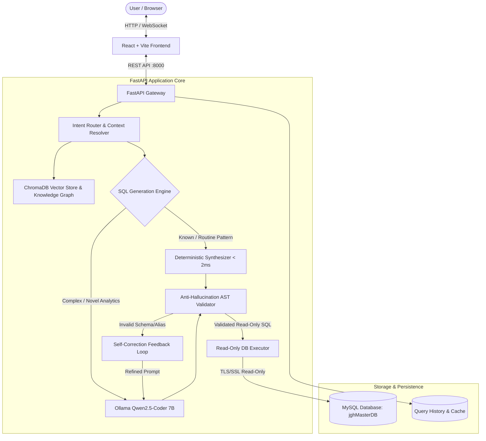

# 🧠 Agentic Analyst (JGH Intelligence Engine)

[](https://www.python.org/)
[](https://fastapi.tiangolo.com/)
[](https://react.dev/)
[](https://vitejs.dev/)
[](https://ollama.com/)
[](https://www.trychroma.com/)
[](https://www.mysql.com/)
[](https://www.docker.com/)

**Agentic Analyst** is an enterprise-grade, read-only AI SQL Agent and Analytics Intelligence Platform. It translates complex natural language business questions into strictly validated, read-only SQL queries, executes them against high-throughput databases, and visualizes the results with interactive charts, dynamic data grids, and multi-format exports.

Built with a dual-engine architecture, it features a **sub-2ms deterministic SQL synthesizer** for instantaneous routine queries, seamlessly backed by an **anti-hallucinating local LLM (Qwen2.5-Coder 7B via Ollama)** with an automated self-correcting Abstract Syntax Tree (AST) validation loop.

---

## 📑 Table of Contents

- [Key Highlights & Capabilities](#-key-highlights--capabilities)
- [System Architecture](#-system-architecture)
- [Multi-Tier Agent Modes](#-multi-tier-agent-modes)
- [Anti-Hallucination & Governance](#-anti-hallucination--governance)
- [Directory Structure](#-directory-structure)
- [Quick Start & Installation](#-quick-start--installation)
  - [Prerequisites](#prerequisites)
  - [Backend Setup](#1-backend-setup)
  - [Frontend Setup](#2-frontend-setup)
  - [Ollama Model Setup](#3-ollama-model-setup-optional)
- [Running the Application](#-running-the-application)
- [Deployment Options](#-deployment-options)
- [REST API Reference](#-rest-api-reference)
- [Testing & Quality Verification](#-testing--quality-verification)
- [Repository & Source](#-repository--source)

---

## 🌟 Key Highlights & Capabilities

### ⚡ Dual-Engine SQL Synthesis
- **Sub-2ms Deterministic Synthesizer**: High-throughput rule and graph-based SQL generator that answers enterprise metrics, aggregations, counts, and joins in microseconds without requiring heavy GPU or LLM inference.
- **Dynamic LLM Fallback (Qwen2.5-Coder 7B)**: Handles complex, novel analytical questions by querying a local Ollama model enriched with vector RAG context.

### 🛡️ Anti-Hallucination AST Validation & Self-Healing
- **Abstract Syntax Tree (AST) Inspection**: Every generated SQL statement undergoes rigorous AST parsing to map table aliases and verify column schemas against dynamic live schema metadata.
- **Automated Feedback Loop**: If an LLM invents non-existent columns or invalid joins, the AST validator catches the error, builds targeted self-correction guidance, and triggers a prompt retry loop.

### 🔍 Vector RAG & Enterprise Knowledge Graph
- **ChromaDB Schema Embeddings**: Automatically generates DDL cards, schema metadata, and business dictionary mappings to inject relevant tables and joins into context.
- **Categorical Enum Dictionaries**: Ingests categorical dumps (`transaction_type`, `user_role`, etc.) to guarantee precise SQL filters without manual configuration.

### 📊 Modern Full-Featured UI (React + Vite)
- **Collaborator AI Chat**: Conversational interface with real-time multi-step progress indicators (`StepProgressLoader`).
- **Dynamic DataGrid**: Tabular results with client-side sorting, column filtering, search, pagination, and row counting.
- **AutoChart Visualizer**: Automatically inspects result shapes to generate bar, line, area, and pie charts.
- **Live Architecture & Simulation Panel**: Interactive node diagram illustrating data flow, active latencies, and real-time query simulation.
- **Enterprise Reporting**: One-click exports to **CSV, Excel (.xlsx), PDF, JSON, and formatted SQL**.
- **Admin Control Center**: Live schema drift detection, ChromaDB embedding rebuilder, and database profiler.
- **Privacy & Incognito Modes**: Mask sensitive PII and bypass query history logging for confidential investigations.

---

## 🏗️ System Architecture



---

## 🎭 Multi-Tier Agent Modes

The platform supports 5 collaborative personas:

| Mode | Purpose | Description |
|:---|:---|:---|
| **Data Analyst** | Core Analytical Querying | Extracts precise metrics, cohort aggregations, financial summaries, and inventory statistics. |
| **Tutor / Explain** | Plain-English Explanations | Deconstructs SQL logic step-by-step, detailing joins, conditions, and business interpretations. |
| **Storyteller** | Narrative Data Storytelling | Synthesizes analytical findings into executive bullet points, trends, and business impact summaries. |
| **ERD Generator** | Visual Data Modeling | Produces dynamic Mermaid entity-relationship diagrams showing database connections. |
| **Dashboard Builder** | KPI Cards & Views | Constructs multi-metric dashboard grids and visual reporting widgets on demand. |

---

## 🔒 Anti-Hallucination & Governance

1. **Strictly Read-Only**: Enforces `SELECT`-only execution. Destructive or mutating operations (`INSERT`, `UPDATE`, `DELETE`, `DROP`, `ALTER`, `TRUNCATE`, `GRANT`) are blocked at both regex and AST levels.
2. **Dynamic Alias Resolution**: AST traversal maps aliases (e.g. `wt` ➔ `wallet_transaction`, `u` ➔ `users`) before checking column validity against `schema_metadata.json`.
3. **AES-256 Fernet Secrets**: Database credentials can be fully encrypted using Fernet encryption (`ENCRYPTED_DB_CONFIG`) and decrypted strictly in volatile RAM at startup via `.master.key`.
4. **Schema Drift Detection**: Compares live database catalogs against cached metadata at boot to alert administrators of schema discrepancies.

---

## 📁 Directory Structure

```plaintext
Agent/
├── app/
│   ├── agent/                 # Intent router, query planner, collaborator personas
│   ├── api/                   # FastAPI endpoints (query, export, admin, history)
│   ├── chroma/                # ChromaDB vector collection storage
│   ├── database/              # Read executor, connection pooling, drift detector
│   ├── embedding/             # ChromaDB vector store builder & DDL card generator
│   ├── knowledge/             # Knowledge graph, DB profiler, schema metadata
│   ├── llm/                   # Ollama interface & deterministic SQL synthesizer
│   ├── prompt/                # Anti-hallucination prompt builders & few-shot rules
│   ├── retriever/             # RAG retrieval logic
│   ├── sql_history/           # Query history logger and caching
│   ├── static/                # Compiled production React frontend bundle
│   ├── utils/                 # PDF, Excel, CSV generators, privacy manager
│   ├── validator/             # SQL AST validator & anti-hallucination checker
│   └── main.py                # Server entry point
├── frontend/
│   ├── public/                # Static public icons and assets
│   ├── src/
│   │   ├── components/        # React components (CenterChat, DataGrid, AutoChart, etc.)
│   │   ├── App.jsx            # Main application layout and view controller
│   │   └── index.css          # Design system, themes, and animations
│   ├── package.json           # Frontend dependencies
│   └── vite.config.js         # Vite configuration & dev proxy
├── knowledge/
│   ├── graph/                 # Business dictionary & relationship graphs
│   └── schema/                # Schema metadata & categorical enum dictionaries
├── scripts/                   # Utility and auditing scripts
├── tests/                     # Unit, integration, and architecture test suites
├── DEPLOYMENT.md              # Production & tunnel deployment guide
├── Dockerfile                 # Containerization definition
├── docker-compose.yml         # Multi-service composition
├── requirements.txt           # Python backend dependencies
├── run_production.bat         # Single-click Windows production server launcher
└── start_server.py            # Diagnostic check & FastAPI launcher
```

---

## 🚀 Quick Start & Installation

### Prerequisites
- **Python**: 3.10 or higher
- **Node.js**: v18.x or higher & `npm`
- **MySQL**: 8.0 server with `jghMasterDB` dataset
- **Ollama** *(Optional for local LLM fallback)*: [ollama.ai](https://ollama.com/)

---

### 1. Backend Setup

```bash
# 1. Clone the repository
git clone https://github.com/sneha-nayak546/Agentic-Analyst.git
cd Agentic-Analyst

# 2. Create and activate a virtual environment
python -m venv venv

# Windows:
.\venv\Scripts\activate
# Linux/macOS:
source venv/bin/activate

# 3. Install backend dependencies
pip install -r requirements.txt

# 4. Configure environment variables
cp .env.example .env
```

Configure your `.env` settings:
```ini
DB_HOST=localhost
DB_PORT=3306
DB_NAME=jghMasterDB
DB_USER=root
DB_PASSWORD=your_mysql_password
ENABLE_LLM_FALLBACK=0   # 1 for Ollama LLM, 0 for fast deterministic synthesizer
LLM_MODEL=qwen2.5-coder:7b
OLLAMA_HOST=http://127.0.0.1:11434
PORT=8000
```

---

### 2. Frontend Setup

```bash
cd frontend

# Install npm dependencies
npm install

# Build the production bundle into app/static (Optional, pre-built static is included)
npm run build

cd ..
```

---

### 3. Ollama Model Setup (Optional)

If enabling `ENABLE_LLM_FALLBACK=1`:
```bash
# Pull the target SQL model
ollama pull qwen2.5-coder:7b

# Start Ollama service
ollama serve
```

---

## 💻 Running the Application

### Option A: Standard Startup with Pre-Flight Diagnostics
```powershell
python start_server.py
```
This runs 4 automated diagnostic checks:
1. Python environment validation
2. Master encryption key & credentials check
3. Database connectivity test
4. LLM / Ollama availability verification

### Option B: Windows Production Launcher
Double-click `run_production.bat` or run:
```bat
run_production.bat
```

### Option C: Vite Dev Server (Hot-Reload Frontend)
In a separate terminal:
```powershell
cd frontend
npm run dev
```
- **Backend API & Embedded App**: [http://localhost:8000](http://localhost:8000)
- **Vite Hot-Reload Dev Server**: [http://localhost:3000](http://localhost:3000)

---

## 🌐 Deployment Options

### Cloudflare Tunnel (Zero-Configuration Public URL)
To provide instant HTTPS access without port forwarding:
```powershell
cloudflared tunnel --url http://localhost:8000
```
This produces a public URL (e.g. `https://your-tunnel-name.trycloudflare.com`) pointing directly to your local instance. For detailed guidance, see [DEPLOYMENT.md](DEPLOYMENT.md).

### Docker Deployment
```bash
docker build -t agentic-analyst .
docker-compose up -d
```

---

## 📡 REST API Reference

| Method | Endpoint | Description |
|:---|:---|:---|
| `GET` | `/health` | Healthcheck and active system diagnostics |
| `POST` | `/query` | Submits a natural language query for SQL synthesis, AST validation, and execution |
| `POST` | `/query/stream` | Server-Sent Events (SSE) streaming query pipeline |
| `POST` | `/agent/collaborate` | Interacts with multi-mode collaborator personas (Tutor, Storyteller, ERD) |
| `GET` | `/schema` | Retrieves indexed enterprise schema metadata and table cards |
| `GET` | `/history` | Fetches session query execution history |
| `POST` | `/export/csv` | Exports result datasets to CSV format |
| `POST` | `/export/excel` | Exports result datasets to formatted `.xlsx` spreadsheets |
| `POST` | `/export/pdf` | Exports structured visual PDF reports |
| `POST` | `/export/sql` | Exports formatted SQL statements |
| `GET` | `/admin/status` | System telemetry, connection pool status, and model info |
| `POST` | `/admin/rebuild-embeddings` | Re-indexes ChromaDB schema vectors |
| `GET` | `/api/architecture/status` | Real-time architecture node status & latency metrics |
| `POST` | `/api/architecture/simulate` | Simulates step-by-step query traversal across system layers |

---

## 🧪 Testing & Quality Verification

Run the automated test suites to verify accuracy, AST validation, and pipeline stability:

```powershell
# Golden accuracy benchmarks
python test_accuracy.py

# End-to-end full pipeline verification
python test_e2e_verification.py

# Retailer earnings & dynamic aggregation test
python test_retailer_earnings.py

# AST validator unit tests
python test_synthesizer_unit.py

# Architecture & endpoint tests
python test_architecture_endpoints.py
```

---

## 🔗 Repository & Source

- **Official Repository**: [https://github.com/sneha-nayak546/Agentic-Analyst](https://github.com/sneha-nayak546/Agentic-Analyst)
- **Author**: Sneha Nayak ([@sneha-nayak546](https://github.com/sneha-nayak546))
- **License**: MIT
