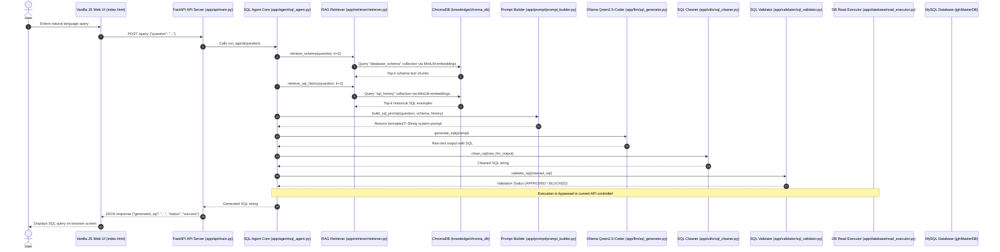
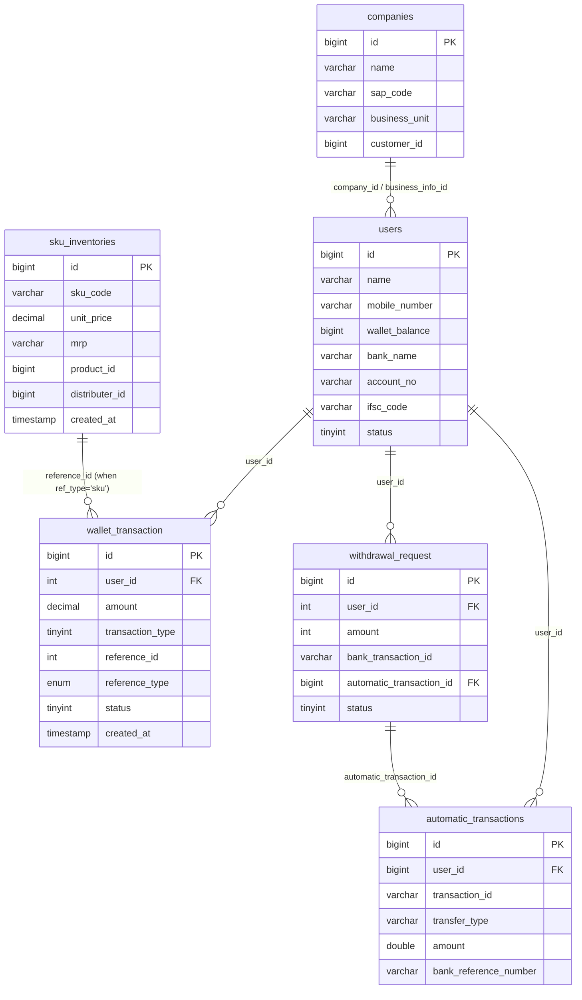

# Architectural Analysis & Production Redesign Plan: AI SQL Agent

This document provides a comprehensive technical audit of the current AI SQL Agent project, documents its execution flow and database schema scope, identifies architectural flaws, and presents a multi-phase production redesign blueprint.

---

## Phase 1: Architectural Analysis of Current Project

### 1. Folder & File Breakdown

#### Root Directory
- **`app/`**: Primary application source directory containing all backend modules, RAG pipeline components, static assets, and API routes.
- **`knowledge/`**: Knowledge base storage containing raw schema metadata, foreign key relationships, generated vector embeddings, business rules, and historical SQL sample PDFs.
- **`logs/`**: Directory designated for application runtime and query execution logs.
- **`reports/`**: Output directory designated for generated data export files (CSV/Excel/PDF).
- **`requirements.txt`**: Dependency manifest specifying Python packages (FastAPI, SQLAlchemy, PyMySQL, ChromaDB, Sentence-Transformers, Ollama, PyPDF, Pandas).
- **`.env`**: Environment configuration file storing MySQL read-only database credentials (`DB_HOST`, `DB_PORT`, `DB_NAME`, `DB_USER`, `DB_PASSWORD`).

#### Application Submodules (`app/`)
- [app/main.py](file:///c:/Users/nayak_o7hopi6/Desktop/Agent/app/main.py): **0-byte empty file**. Placed at the root of `app/` as an uninitialized entry point.
- [app/api/main.py](file:///c:/Users/nayak_o7hopi6/Desktop/Agent/app/api/main.py): FastAPI application initialization, CORS middleware configuration, static files mount (`/static`), and HTTP POST endpoint (`/query`) for user natural language questions.
- [app/agent/sql_agent.py](file:///c:/Users/nayak_o7hopi6/Desktop/Agent/app/agent/sql_agent.py): Main orchestration module. Contains `run_agent(question)` function that coordinates schema retrieval, SQL history retrieval, prompt construction, Ollama LLM generation, SQL cleaning, and regex validation. Also includes an interactive CLI REPL `while True` loop.
- [app/database/allowed_tables.py](file:///c:/Users/nayak_o7hopi6/Desktop/Agent/app/database/allowed_tables.py): Defines `ALLOWED_TABLE_NAMES` set and `is_allowed_table()` lookup function for schema filtering.
- [app/database/connection.py](file:///c:/Users/nayak_o7hopi6/Desktop/Agent/app/database/connection.py): SQLAlchemy engine instantiation script for MySQL connection verification and database listing (`SHOW DATABASES`).
- [app/database/metadata_extractor.py](file:///c:/Users/nayak_o7hopi6/Desktop/Agent/app/database/metadata_extractor.py): Extracts table names, column names, data types, and nullability constraints from `information_schema.columns` via SQLAlchemy for allowed tables and saves output to `knowledge/schema/schema_metadata.json`.
- [app/database/read_executor.py](file:///c:/Users/nayak_o7hopi6/Desktop/Agent/app/database/read_executor.py): Database query execution engine. Uses `mysql.connector` and `pandas` to execute queries and return DataFrames.
- [app/embedding/chroma_builder.py](file:///c:/Users/nayak_o7hopi6/Desktop/Agent/app/embedding/chroma_builder.py): Embedding generation script for database schema chunks using `sentence-transformers` (`all-MiniLM-L6-v2`) and persistent storage in ChromaDB (`database_schema` collection).
- [app/embedding/embedding_builder.py](file:///c:/Users/nayak_o7hopi6/Desktop/Agent/app/embedding/embedding_builder.py): **Duplicate embedding script** populating Chroma collection `sql_knowledge`.
- [app/embedding/sql_history_embedding.py](file:///c:/Users/nayak_o7hopi6/Desktop/Agent/app/embedding/sql_history_embedding.py): Embedding generator for historical SQL query examples into Chroma collection `sql_history`.
- [app/knowledge/relationship_builder.py](file:///c:/Users/nayak_o7hopi6/Desktop/Agent/app/knowledge/relationship_builder.py): Queries MySQL `information_schema.KEY_COLUMN_USAGE` to extract foreign key constraints between allowed tables and writes to `knowledge/relationships/relationships.json`.
- [app/knowledge/schema_builder.py](file:///c:/Users/nayak_o7hopi6/Desktop/Agent/app/knowledge/schema_builder.py): Merges `schema_metadata.json` and `relationships.json` into unstructured natural language text chunks (`knowledge_chunks.json`).
- [app/knowledge/knowledge_builder.py](file:///c:/Users/nayak_o7hopi6/Desktop/Agent/app/knowledge/knowledge_builder.py): **0-byte empty file**. Unused placeholder.
- [app/knowledge/sql_history_builder.py](file:///c:/Users/nayak_o7hopi6/Desktop/Agent/app/knowledge/sql_history_builder.py): **0-byte empty file**. Duplicate path placeholder.
- [app/llm/qwen.py](file:///c:/Users/nayak_o7hopi6/Desktop/Agent/app/llm/qwen.py): **0-byte empty file**. Unused LLM wrapper module.
- [app/llm/sql_generator.py](file:///c:/Users/nayak_o7hopi6/Desktop/Agent/app/llm/sql_generator.py): Wrapper around `ollama.chat()` calling model `qwen2.5-coder:7b` at `temperature=0.1`.
- [app/prompt/prompt_builder.py](file:///c:/Users/nayak_o7hopi6/Desktop/Agent/app/prompt/prompt_builder.py): Constructs LLM prompt containing schema context, SQL history examples, user question, and strict formatting/date/aggregation/safety rules.
- [app/retriever/retriever.py](file:///c:/Users/nayak_o7hopi6/Desktop/Agent/app/retriever/retriever.py): RAG retrieval client querying ChromaDB collections (`database_schema` and `sql_history`) using `all-MiniLM-L6-v2`.
- [app/chroma/retriever.py](file:///c:/Users/nayak_o7hopi6/Desktop/Agent/app/chroma/retriever.py): **0-byte empty file**. Duplicate module placeholder.
- [app/chroma/build_embeddings.py](file:///c:/Users/nayak_o7hopi6/Desktop/Agent/app/chroma/build_embeddings.py): **0-byte empty file**. Duplicate module placeholder.
- [app/sql_history/sql_history_builder.py](file:///c:/Users/nayak_o7hopi6/Desktop/Agent/app/sql_history/sql_history_builder.py): Extracts SQL text from PDF (`knowledge/sql_history/sql_history.pdf`), splits queries by `;`, filters queries mentioning allowed tables, and outputs `sql_history_chunks.json`.
- [app/sql_history/sql_history_loader.py](file:///c:/Users/nayak_o7hopi6/Desktop/Agent/app/sql_history/sql_history_loader.py): Alternative PDF parser splitting by `"SELECT"`.
- [app/static/index.html](file:///c:/Users/nayak_o7hopi6/Desktop/Agent/app/static/index.html): Vanilla HTML/CSS/JavaScript web interface rendering input textarea and displaying raw generated SQL text.
- [app/utils/sql_cleaner.py](file:///c:/Users/nayak_o7hopi6/Desktop/Agent/app/utils/sql_cleaner.py): Regex cleaner extracting SQL code inside ` ```sql ` markdown code blocks or stripping text preceding `SELECT`.
- [app/validator/sql_validator.py](file:///c:/Users/nayak_o7hopi6/Desktop/Agent/app/validator/sql_validator.py): Basic regex security check ensuring statement starts with `SELECT` and contains no blocked keywords (`INSERT`, `UPDATE`, `DELETE`, `DROP`, `ALTER`, `TRUNCATE`, `CREATE`, `REPLACE`, `GRANT`, `REVOKE`).

---

### 2. Execution Flow



#### Detailed Layer Breakdown:
1. **Application Startup**: FastAPI starts via Uvicorn, loads environment variables from `.env`, initializes CORS middleware, and mounts static files (`/static`).
2. **Query Processing**: User submits query to `POST /query`.
3. **RAG Pipeline**:
   - `retrieve_schema()` converts user string to 384-dim dense vector using `SentenceTransformer("all-MiniLM-L6-v2")` and fetches `k=3` matching schema chunks from ChromaDB.
   - `retrieve_sql_history()` fetches `k=2` matching historical SQL queries.
4. **Prompt Assembly**: `build_sql_prompt()` formats retrieved contexts, table rules, and user question into a monolithic text block.
5. **SQL Generation**: `generate_sql()` submits prompt to Ollama running model `qwen2.5-coder:7b`.
6. **Cleaning & Regex Validation**: Code blocks are stripped and regex scans for forbidden keywords (`DROP`, `DELETE`, etc.).
7. **Current Disconnect**: `read_executor.py` exists in the codebase but is **completely disconnected** from `api/main.py` and `sql_agent.py`. SQL queries are generated and validated but **never executed**, and query results are never returned to the frontend.

---

### 3. Comprehensive Problem Identification

| Problem Category | Issue Description & Architectural Root Cause |
| :--- | :--- |
| **1. Code Signature Mismatch Bug** | `app/api/main.py` invokes `run_agent(question, "")` (2 arguments), but `run_agent` in `app/agent/sql_agent.py` only accepts 1 argument (`question`). Calling `POST /query` crashes with `TypeError`. |
| **2. Dead/Unused Code & Shell Files** | 6 files in the codebase are 0-byte empty files (`app/main.py`, `app/knowledge/knowledge_builder.py`, `app/knowledge/sql_history_builder.py`, `app/llm/qwen.py`, `app/chroma/retriever.py`, `app/chroma/build_embeddings.py`). |
| **3. Duplicate Embedding & Loader Pipelines** | `app/embedding/chroma_builder.py` and `app/embedding/embedding_builder.py` build duplicate collections. `app/sql_history/sql_history_builder.py` and `app/sql_history/sql_history_loader.py` contain redundant PDF parsing routines. |
| **4. Database Disconnect** | Generated SQL is never executed against MySQL. `read_executor.py` is isolated and unused in API/Agent flow. |
| **5. Naïve & Flawed RAG Implementation** | Schema context is split into arbitrary chunks (`k=3`), leading to fragmented table definitions where join tables or foreign keys are missed during vector search. `all-MiniLM-L6-v2` is a generic sentence embedder poorly suited for structured SQL DDL schemas. |
| **6. Primitive Regex SQL Validation** | `sql_validator.py` uses word-boundary regex (`\bDELETE\b`). It fails on comments containing keywords, table column names containing blocked terms (e.g. `is_deleted`), or subqueries. It lacks AST parsing capability. |
| **7. Prompt Hallucination Risks** | Prompt includes hardcoded static examples and rules mixed directly in text, leading to context contamination where the LLM picks up obsolete table columns or example values. |
| **8. Security Vulnerabilities** | Read-only connection enforcement is reliant purely on application-level regex. If regex is bypassed, SQL execution has full access permissions of the database user configured in `.env`. |
| **9. Performance Bottlenecks** | Vector embedding model (`SentenceTransformer`) is re-instantiated on every module import in `retriever.py`. Ollama model invocation is synchronous and blocks the FastAPI event loop. |
| **10. Front-End Limitations** | Vanilla HTML frontend displays static text box only. Lacks query result rendering, tabular views, SQL syntax highlighting, query history, export capabilities, or admin settings. |

---

## Database Scope Audit

### Final Target Tables
The AI SQL Agent must strictly operate on these 8 target tables:

1. **`users`**: Core user entity table containing profile details, wallet balance, bank details, and status.
2. **`wallet_transaction`**: Financial transaction log recording credits/debits, amounts, transaction types, reference IDs, and timestamps.
3. **`sku_inventory`** *(DB Schema Name: `sku_inventories`)*: Inventory catalog containing SKU codes, MRP, unit prices, product IDs, batch details, and wholesaler/retailer scan timestamps.
4. **`companies`**: Enterprise/company entity details, business units, SAP codes, and deactivated QR limits.
5. **`machine_details`**: Machine specification table (Reserved domain table entity).
6. **`withdrawal`** *(DB Schema Name: `withdrawal_request`)*: User payout request table containing amounts, status, bank transaction IDs, and TDS deductions.
7. **`automatic_transaction_bank`** *(DB Schema Name: `automatic_transactions`)*: Bank API payout execution log storing reference IDs, transfer types, res codes, account numbers, and response data.
8. **`automate`**: Automated task execution & configuration table.

### Schema Relationships & Constraint Matrix



### Key Columns & Table Interactions

- **`users` ↔ `wallet_transaction`**: Joined via `users.id = wallet_transaction.user_id`. Used for computing user balances, user transaction histories, and user ranking reports.
- **`users` ↔ `withdrawal_request`**: Joined via `users.id = withdrawal_request.user_id`. Used for payout reporting, pending withdrawals, and user withdrawal sums.
- **`withdrawal_request` ↔ `automatic_transactions`**: Joined via `withdrawal_request.automatic_transaction_id = automatic_transactions.id`. Used for auditing bank transfer status against user withdrawal requests.
- **`companies` ↔ `users`**: Joined via `companies.business_info_id = users.business_info_id`. Used for company-level user aggregations.

### Referenced Non-Scope Tables
The following tables exist in `knowledge/schema/schema_metadata.json` but are explicitly **EXCLUDED** from RAG context generation:
`academy_videos`, `account_deletion_requests`, `activate_qrs_requests`, `addresses`, `adhaar_verifications`, `bank_accounts`, `beat_plans`, `billings`, `bonus_transactions`, `gift_cards`, `orders`, `vendors`, etc. (Total 226 excluded tables).

---

## Phase 2: Production Redesign Plan

### 1. Better Project Architecture
- **Layered Clean Architecture**:
  - `app/core/`: Application settings, environment management (Pydantic Settings), logging configuration.
  - `app/domain/`: Pure domain models, database schemas, Pydantic DTOs.
  - `app/services/`: Core logic modules (RAG Engine, Prompt Builder, SQL Synthesizer, AST Validator, Query Executor, Exporter).
  - `app/api/v1/`: Versioned REST API endpoints (`/chat`, `/query`, `/history`, `/reports`, `/admin`, `/health`).
  - `app/infrastructure/`: Vector database adapters, DB connection pooling, Ollama LLM HTTP client.

### 2. Better RAG Architecture
- **Deterministic Schema Ingestion**:
  - Dump exact DDL statements with index information and column descriptions for the 8 target scope tables.
  - Structure vector documents as full contextual table cards (Table name, DDL, Primary Keys, Foreign Keys, Sample Enum values, Domain aliases).
  - Eliminate chunk splitting fragmentation so complete table schemas are retrieved atomically.
- **Graph-Aware Schema Retrieval**:
  - When a query retrieves a table (e.g. `wallet_transaction`), automatically inject connected target tables (`users`) via schema relationship graph mapping.

### 3. Better Embedding Strategy
- Upgrade embedding model from generic `all-MiniLM-L6-v2` to code/SQL-optimized local embeddings (e.g. `bge-base-en-v1.5` or `snowflake-arctic-embed-m`).
- Persistent ChromaDB collection management with schema version hashing to prevent duplicate embedding builds.

### 4. Better Prompt Engineering
- System-User role separation using Ollama chat format.
- Strict DDL injection format + Dialect specifications (MySQL 8.0).
- Few-Shot Example Selector: Dynamically pick 2 highly relevant golden SQL pairs using vector similarity matching.
- Forced JSON output schema or code block syntax for deterministic parsing.

### 5. Better SQL Generation Pipeline
- **Multi-Stage Generation Loop**:
  1. Intent Analysis & Target Table Identification.
  2. Schema & Relationship Context Retrieval.
  3. Candidate SQL Synthesis via local LLM (`qwen2.5-coder:7b` / `deepseek-coder:6.7b`).
  4. AST Parsing & Safety Check.
  5. Automatic Self-Correction Loop: If AST validation or MySQL `EXPLAIN` yields errors, feed error back to LLM for retry (max 2 retries).

### 6. Better SQL Validation
- Replace primitive regex with **SQLGlot AST (Abstract Syntax Tree) Parsing**:
  - Verify root AST node is strictly `exp.Select`.
  - Traverse AST syntax tree to ensure no write nodes (`exp.Insert`, `exp.Update`, `exp.Delete`, `exp.Drop`, `exp.Alter`, `exp.Create`) exist.
  - Validate column names and table names in AST against allowed scope schema catalog.

### 7. Better SQL Optimization
- Pre-execution AST Transformer:
  - Inject automatic `LIMIT 100` on unaggregated queries if `LIMIT` clause is omitted by LLM.
  - Ensure indexed columns are used in `WHERE` and `JOIN` conditions.
- MySQL `EXPLAIN` execution check prior to query run to estimate cost and block heavy full-table scans.

### 8. Better Report Generation
- Stream large database result sets using Pandas / Arrow memory buffers.
- Async report export engine generating downloadable CSV, Excel (`.xlsx` with formatted headers), and PDF documents on demand.
- File storage management with cleanup TTL in `reports/` directory.

### 9. Better Frontend Architecture
- Replace single HTML page with a **Modern Modern Web Interface**:
  - Chat interface with streaming responses.
  - Dynamic Data Table component with sorting, pagination, search, and column filtering.
  - Interactive SQL Viewer with copy-to-clipboard and syntax highlighting.
  - Download trigger buttons for CSV, Excel, PDF.
  - SQL History drawer showing recent queries and execution status.

### 10. Better Admin Panel
- Dedicated Admin dashboard interface:
  - Schema Indexing Control: Trigger schema metadata sync and vector re-indexing with 1 click.
  - Dynamic Table Scope Manager: Inspect active target tables and column metadata.
  - Audit Logs Viewer: Review user queries, generated SQL, execution latency, and user feedback ratings.
  - System Health & Ollama Model Selector: Monitor local LLM status and switch active Ollama model.

---

## Verification Plan

### Automated Verification
- **Unit & Integration Tests**:
  - Test AST validator against malicious SQL injection strings (e.g. `SELECT * FROM users; DROP TABLE users;`).
  - Test RAG retriever precision for target table retrieval across 20 natural language benchmark questions.
  - Test API route parameters and responses using FastAPI `TestClient`.

### Manual Verification
- End-to-end verification of query pipeline against live read-only MySQL database.
- Visual inspection of frontend chat interface, tabular query rendering, and report exports.
